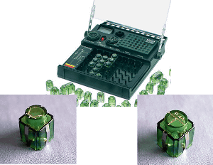
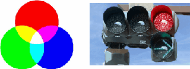
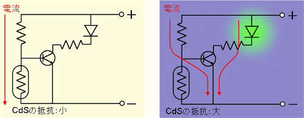
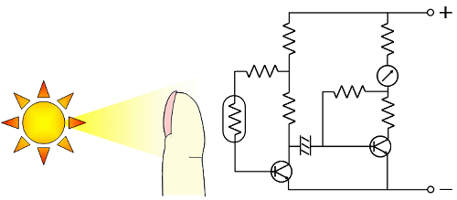

# ～電子回路を自分で作って動かそう～
----
## 電子ブロックとは

抵抗，コンデンサ，トランジスタなどのブロックを組み合わせることによって，様々な電子機器が作れます．
ブロックを本体に並べるだけで，回路が完成します．
ここでは，電子ブロックを使って自分で回路を作り，それを使って実験をしてもらいます．
実験を通して，電子回路の働きを知ると共に，大学で行われている研究の一端に触れてもらいます．

----

## 発光ダイオードで三原色を作ろう

発光ダイオードは半導体を利用して電気を光に変換する装置です． とても効率が良いのでどんどん生活の中に入り込んできています． でも，皆さんが生まれた頃にはまだそれ程使われていませんでした． これは，青い光を出せる発光ダイオードが発明されてなかったからです． 世界で初めて青色発光ダイオードが産声を上げたのは名古屋大学です． この青色発光ダイオードの発明に対して，赤﨑勇教授と天野浩教授（現：名古屋大学教授）はノーベル物理学賞を2014年に受賞しました．ここでは実際に発光ダイオードを使って光の三原色を出してもらいます．

----

## 明るさセンサーを作ろう

夜，暗くなると街灯が灯ります．光センサーと呼ばれる技術です． ある種の半導体は光を照射されると電気抵抗が変化する性質を持っています． これと，トランジスタを組み合わせる事で明るさセンサーが作れます． ここでは，明るさセンサーを自作してもらう事で，トランジスタの動作原理を知ってもらいます． きちんと動く明るさセンサーを作るには，適切に回路を組む必要があります． 悩み，手を動かし，自分で動くものを作り上げる 「物つくり」の楽しさを味わってもらいます．

----
## 脈拍計を作ろう

最後の実験では，最先端の研究につながる科学実験を体験してもらいます． これは，明るさセンサーの応用で，とても簡単な実験ではありますが，発見や発明につながる たくさんのヒントが詰まっています． 光のセンサー部分に指を当てましょう． 指先を流れる血液が光を遮ることにより，センサーに届く光の量が変わります． ただし，この変化はとても小さいので，トランジスタやコンデンサを使った工夫が必要です．

血液は赤い色をしてますね． では，脈拍を計る際に，実験１で作った発光ダイオードを使ってみましょう． 赤い光と青い光を当てたときに，脈拍計の針の振れはどう変わるでしょうか？ 実験を行い，ナゼの部分を一緒に考えていきましょう． ここで学んでもらう脈拍計の原理は，レントゲンや静脈認識など，身近なところでも利用されていますし，最先端の研究にも当てはめる事ができます． 光もX線も電波もみな同じ電磁波の仲間です． 他の電磁波を使うとどうなるでしょう．

----

さあ，皆さんも一緒に光と電子が作り出す不思議と便利の世界を探検しましょう！