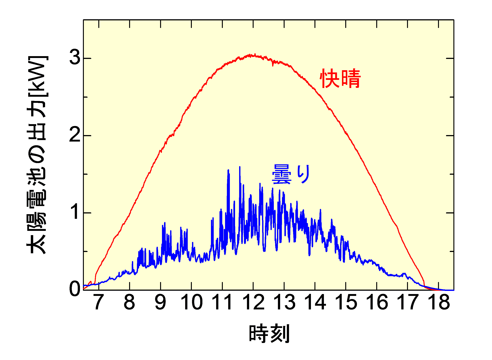
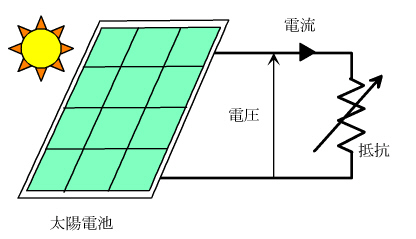

# ～再生可能エネルギーの有効活用～
----

## はじめに

太陽電池が太陽光を電気エネルギーに効率良く変換するためには，実は，ある制御装置が用いられています．この実験テーマでは，簡易的な制御装置をつくり，太陽光の効率の良い電気エネルギーへの変換を体験してもらいます．

---

## 太陽電池の出力は日射量に依存します

太陽電池は日射のある昼間にのみ発電することができます．日射量が多いほど，太陽電池はたくさん発電することができます．そのため，下図に示す天候の違いによる太陽電池の出力の時間変化例に見られるように，太陽電池による発電は天候に左右されやすいと言えます．

---

## 太陽電池の出力が最大となる条件が存在します

太陽電池は，日射量が一定であっても，太陽電池に接続される抵抗の大きさが変わると，電圧，電流ともに値が変化する特性を持っています．太陽電池の出力（電力）は，電圧×電流で表すことができますが，実は，出力が最大となる電圧が存在します．太陽電池から効率良く電力を得るためには，この特性をうまく利用する必要があります．実際に用いられている太陽光発電システムの場合，常に最大電力が得られるように，MPPT（Maximum Power Point Tracker：最大電力点追尾）制御と呼ばれる制御方法が使われています．

この実験テーマでは，簡単な制御装置として，太陽電池の出力電圧を制御する装置をつくります．それを使って，性能を確かめてみましょう．