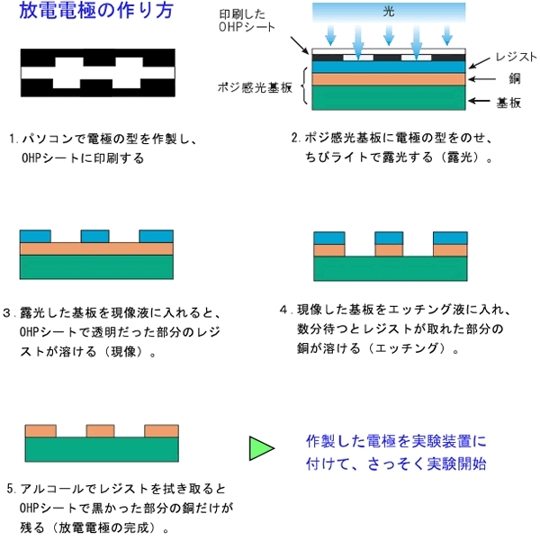

---

## プラズマとは

物質は，原子や分子から構成されています． 
この原子，分子は通常，電荷をもたない中性状態にありますが， 外部からエネルギーをもらうことで，原子，分子内部の電子が外にはじき出されたり，逆に電荷をもらったりすると，イオンになります． 
正の電荷を持つイオンを正イオン(positive ion)，負の電荷を持つイオンを負イオン(negative ion)といいます． 正の電荷（正イオン）と負の電荷（負イオン，電子）の量がほぼ等しく電気的に中性を保っている電離気体のことをプラズマといい，放電時に生成されます．

---

## くらしの中でのプラズマの利用

空気中で放電現象が起きると，高エネルギーの電子を含むプラズマが生成されます． 
プラズマ中の電子は，空気中に存在する分子に衝突して，それらを分解し電離させ，オゾンや様々な（クラスター）イオンを生成します． これらはいずれも非常に化学反応を起こしやすい物質で臭いの元やカビ等を分解してしまうのです．

---

## 大気圧プラズマを発生させよう

イオンの発生方法には様々なものがありますが，今回の実験は大気圧放電を利用した負イオン発生器の最も重要な部品である放電電極を作製します． 電極の形状によってオゾンや正・負イオンの発生量が大きく変わりますので，グループごとにさまざまな形状の電極を試して特性の違いを調べましょう． 電極の間隔が近すぎると電子のエネルギーが十分でなくオゾンや負イオンなどの活性種が発生しません． 一方，遠すぎるとエネルギーが高くなりすぎたり放電自体が起こらなくなったりします． 下図は負イオン発生方式の一例と放電電極の作り方です．

作製した電極を使って実際に放電プラズマを作り、オゾンの発生を確認してみましょう．

---